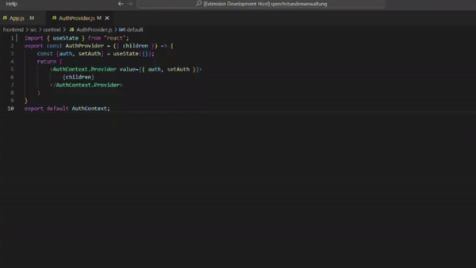

# helperai README

Do you need help with your development? Then this extension is exactly what you need. Your personal AI assistant is there to support you when you wonder why something doesn't work. 

## Features

After the installation you are ready to go. Just press `STRG + SHIFT + P` to open the command executor and type "What's Wrong". After a few seconds you will get a push message with possible compiler and logic errors in the current file.

Consider the following example of a React application

> Hint: Activate key bindings so that you can work more quickly

___
## Known Issues
Nothing to see here... yet
## Release Notes
Here you can find the last release notes
### 0.0.2
- Released initial publish for Helper AI
### 0.0.3
- Migrate to new VSCode version

If you like my extension and want to support me, consider buying me a coffee:
Pascal0707@gmx.de